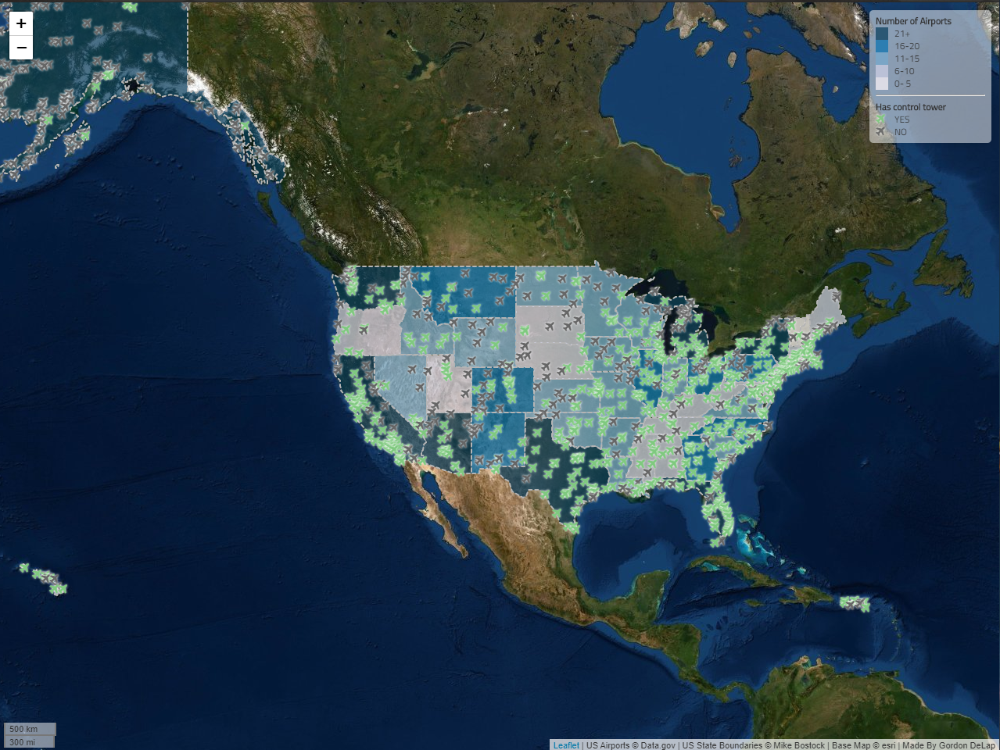

# US Airports Web Map

## Description
This is a choropleth map of the number of airports in the United States aggregated by state. Additionally, each airport is mapped based on whether or not it has any air traffic control towers. You can click on each airport to determine the name. Access the interactive map [here](https://gordydelap.github.io/US-Airports-Web-Map/).
### Data Sources
- `airports.geojson` containing all the airports in the United States from [Data.gov](https://catalog.data.gov/dataset/usgs-small-scale-dataset-airports-of-the-united-states-201207-shapefile).
- `us-states.geojson` containing US state boundaries from [Mike Bostock](http://bost.ocks.org/mike) of [D3](http://d3js.org/).
- Esri's World Imagery basemap.
### Acknowledgement
Based on Professor Bo Zhao's [Lab 3: Web Map Design](https://github.com/jakobzhao/geog458/tree/master/labs/lab03).
